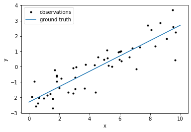
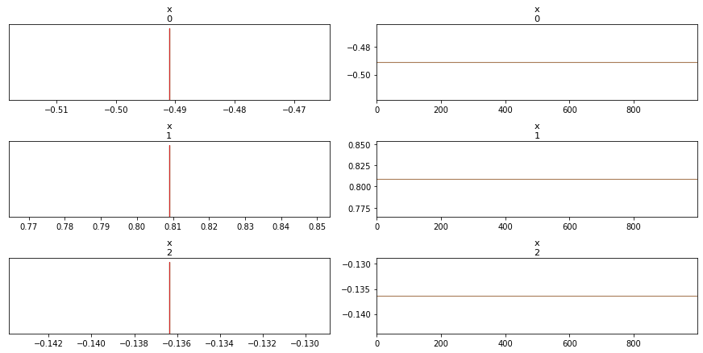

.. module:: littlemcmc

.. note:: This tutorial was generated from an IPython notebook that can be
          downloaded `here <../../_static/notebooks/framework_cookbook.ipynb>`_.

.. _framework_cookbook:

Framework Cookbook
==================

``littlemcmc`` only needs a ``logp_dlogp_func``, which is
framework-agnostic. To illustrate this, this cookbook implements linear
in multiple frameworks, and samples them with ``littlemcmc``. At the end
of this notebook, we load the inference traces and sampler statistics
into ArviZ and do some basic visualizations.

.. code:: python

    import littlemcmc as lmc

Create and Visualize Data
-------------------------

.. code:: python

    import numpy as np
    import matplotlib.pyplot as plt
    
    np.random.seed(42)
    
    true_params = np.array([0.5, -2.3, -0.23])
    
    N = 50
    t = np.linspace(0, 10, 2)
    x = np.random.uniform(0, 10, 50)
    y = x * true_params[0] + true_params[1]
    y_obs = y + np.exp(true_params[-1]) * np.random.randn(N)
    
    plt.plot(x, y_obs, ".k", label="observations")
    plt.plot(t, true_params[0]*t + true_params[1], label="ground truth")
    plt.xlabel("x")
    plt.ylabel("y")
    plt.legend()
    plt.show()





PyTorch
-------

.. code:: python

    import torch
    
    class LinearModel(torch.nn.Module):
        def __init__(self):
            super(LinearModel, self).__init__()
            self.m = torch.nn.Parameter(torch.tensor(0.0, dtype=torch.float64))
            self.b = torch.nn.Parameter(torch.tensor(0.0, dtype=torch.float64))
            self.logs = torch.nn.Parameter(torch.tensor(0.0, dtype=torch.float64))
            
        def forward(self, x, y):
            mean = self.m * x + self.b
            loglike = -0.5 * torch.sum((y - mean) ** 2 * torch.exp(-2 * self.logs) + 2 * self.logs)
            return loglike
    
    torch_model = torch.jit.script(LinearModel())
    torch_params = [torch_model.m, torch_model.b, torch_model.logs]
    args = [torch.tensor(x, dtype=torch.double), torch.tensor(y_obs, dtype=torch.double)]
    
    def torch_logp_dlogp_func(x):
        for i, p in enumerate(torch_params):
            p.data = torch.tensor(x[i])
            if p.grad is not None:
                p.grad.detach_()
                p.grad.zero_()
    
        result = torch_model(*args)
        result.backward()
    
        return result.detach().numpy(), np.array([p.grad.numpy() for p in torch_params])


.. parsed-literal::

    298 µs ± 43.8 µs per loop (mean ± std. dev. of 7 runs, 1000 loops each)


Please see
```sample_pytorch_logp_dlogp_func.py`` <https://github.com/eigenfoo/littlemcmc/tree/master/docs/_static/scripts/sample_pytorch_logp_dlogp_func.py>`__
for a working example. Theoretically, however, all that’s needed is to
run the following snippet:

.. code:: python

   trace, stats = lmc.sample(
       logp_dlogp_func=torch_logp_dlogp_func, model_ndim=3, tune=500, draws=1000, chains=4,
   )

JAX
---

.. code:: python

    from jax.config import config
    config.update("jax_enable_x64", True)
    
    import jax
    import jax.numpy as jnp
    
    def jax_model(params):
        mean = params[0] * x + params[1]
        loglike = -0.5 * jnp.sum((y_obs - mean) ** 2 * jnp.exp(-2 * params[2]) + 2 * params[2])
        return loglike
    
    @jax.jit
    def jax_model_and_grad(x):
        return jax_model(x), jax.grad(jax_model)(x)
    
    
    def jax_logp_dlogp_func(x):
        v, g = jax_model_and_grad(x)
        return np.asarray(v), np.asarray(g)


.. parsed-literal::

    /Users/george/miniconda3/lib/python3.7/site-packages/jax/lib/xla_bridge.py:125: UserWarning: No GPU/TPU found, falling back to CPU.
      warnings.warn('No GPU/TPU found, falling back to CPU.')


.. parsed-literal::

    269 µs ± 48.6 µs per loop (mean ± std. dev. of 7 runs, 1 loop each)


Please see
```sample_jax_logp_dlogp_func.py`` <https://github.com/eigenfoo/littlemcmc/tree/master/docs/_static/scripts/sample_jax_logp_dlogp_func.py>`__
for a working example. Theoretically, however, all that’s needed is to
run the following snippet:

.. code:: python

   trace, stats = lmc.sample(
       logp_dlogp_func=jax_logp_dlogp_func, model_ndim=3, tune=500, draws=1000, chains=4,
   )

PyMC3
-----

.. code:: python

    import pymc3 as pm
    import theano
    
    with pm.Model() as pm_model:
        pm_params = pm.Flat("pm_params", shape=3)
        mean = pm_params[0] * x + pm_params[1]
        pm.Normal("obs", mu=mean, sigma=pm.math.exp(pm_params[2]), observed=y_obs)
        
    pm_model_and_grad = pm_model.fastfn([pm_model.logpt] + theano.grad(pm_model.logpt, pm_model.vars))
    
    def pm_logp_dlogp_func(x):
        return pm_model_and_grad(pm_model.bijection.rmap(x))


.. parsed-literal::

    46.3 µs ± 3.94 µs per loop (mean ± std. dev. of 7 runs, 10000 loops each)


.. code:: python

    trace, stats = lmc.sample(
        logp_dlogp_func=pm_logp_dlogp_func,
        model_ndim=3,
        tune=500,
        draws=1000,
        chains=4,
        progressbar=False,  # Progress bars don't render well in reStructuredText docs...
    )

Visualize Traces with ArviZ
---------------------------

Just to sanity check our results, let’s visualize all the traces using
ArviZ. At the time of writing there’s no way to easily load the
``np.ndarrays`` arrays that ``littlemcmc`` returns into an
``az.InferenceDataset``. Hopefully one day we’ll have an
``az.from_littlemcmc`` method… but until then, please use this code
snippet!

.. code:: python

    def arviz_from_littlemcmc(trace, stats):
        return az.InferenceData(
            posterior=az.dict_to_dataset({"x": trace}),
            sample_stats=az.dict_to_dataset({k: v.squeeze() for k, v in stats.items()})
        )

.. code:: python

    import arviz as az
    
    dataset = arviz_from_littlemcmc(trace, stats)
    
    az.plot_trace(dataset)
    plt.show()





